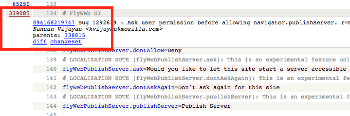
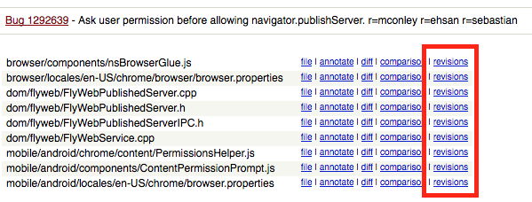

# How to identify the bug that introduced a string
Sometimes it’s helpful to identify which bug introduced a specific string, for example to check if an issue was already reported, or find more background on a feature.

## Find the string
The first step is to identify where the string is within the Mercurial repository, and the fastest way is to use [Transvision](https://transvision.mozfr.org).

For example, I want to know which bug introduced the string `Would you like to let this site start a server accessible to nearby devices and people?`. I can search for the [string](https://transvision.mozfr.org/?recherche=Would+you+like+to+let+this+site+start+a+server+accessible+to+nearby+devices+and+people%3F&repo=aurora&sourcelocale=en-US&locale=it&search_type=strings_entities&perfect_match=perfect_match) or the identifier (if I know it).

In the results, I can use the `<source>` link in the en-US column to [open the file](https://hg.mozilla.org/releases/mozilla-aurora/file/default/mobile/android/locales/en-US/chrome/browser.properties) in Mercurial.

## Find the bug
At the top of the page there’s an **annotate** link that will display the changeset associated to each line.

At this point I only need to search in the page for the string, hover the link on the leftmost column, and select the [changeset link](https://hg.mozilla.org/releases/mozilla-aurora/rev/89a168219747) in the popup. The commit message will have a link to the [bug](https://bugzilla.mozilla.org/show_bug.cgi?id=1292639), and I can then check dependencies and comments.

## Looking at older revisions
This method doesn’t always work: sometimes a changeset only moves strings around, so you would need to repeat the process for an older revision of the file.

At the top of the changeset, there’s a list of the modified files. Near each file there’s a **revisions** link.

At this point you can pick an older revision of the file by opening the **diff** link for the changeset you’re interested in, and repeat the process by selecting **annotate** near the file you’re analyzing.
