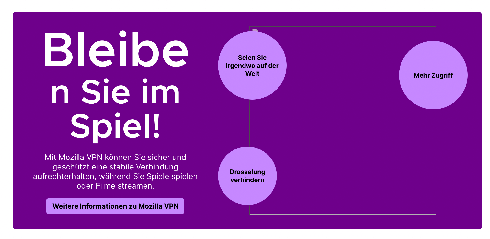
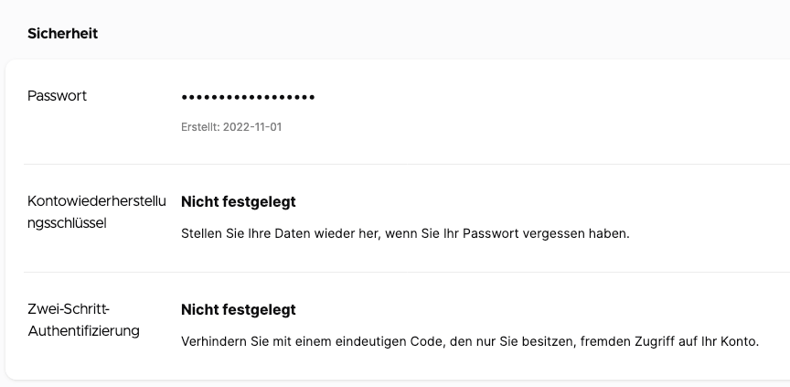

# Localization best practices for developers

<!-- toc -->

This document provides best practices for developers to create localizable code, and describes how to avoid some common localizability mistakes. Some additional guidelines specific for Fluent in Firefox are also available in [this page](https://firefox-source-docs.mozilla.org/l10n/fluent/review.html), and there is a [collection of FAQs specific for Firefox localization](../products/firefox_desktop/firefox_l10n_faqs.md).

Specific channels dedicated to localization are available on Matrix, in case you have more questions:
* [#l10n-community](https://chat.mozilla.org/#/room/#l10n-community:mozilla.org) is used by localizers, and it’s a good place to ask for questions about specific languages.
* [#l10n-dev](https://chat.mozilla.org/#/room/#l10n-dev:mozilla.org) can be used for more technical questions.
* [#i18n](https://chat.mozilla.org/#/room/#i18n:mozilla.org) is the channel of the Internationalization (i18n) team.

## Note on localizers

Mozilla localizers are volunteers with very diverse technical skills and backgrounds: some of them rely exclusively on translation tools and have a linguistic education, others prefer to work directly with text editors and don’t have problems interacting with version control systems (VCS) or reading code.

It’s important to consider this when adding strings, and especially localization comments for strings that contain references or technical details.

## Localization files

### String identifiers (IDs)

In most localization formats, a translation unit consists of a unique identifier (ID, often *string ID* or *message ID*) associated to a segment of text. The ID chosen for your string, regardless of the file format, should always be descriptive of the message and its role in the interface (button label, title, etc.). Using specific IDs also will discourage other developers from [reusing strings](#dont-reuse-strings-in-different-contexts) in different contexts.

In most case, when **updating an existing string** already exposed for localization, a new string ID is necessary (for more details, see [this document](making_string_changes.md)):
* If you are changing a string such that its **meaning has changed**, you must update the string ID.
* In case of Fluent, you need to update the string ID also when **the morphology of the message changes**, i.e. attributes are added or removed.
* If your changes are relevant only for English — for example, to correct a typographical error or to make capitalization consistent — then there is generally no need to update the string ID.

There is a gray area between needing a new ID or not. In some cases, it will be necessary to look at all the existing translations to determine if a new ID would be beneficial. You should always reach out to the l10n team in case of doubt.

If a new ID is needed, adding a progressive number to the existing ID should always be used as a last resort. For example, suppose this string needs to be changed from `Event` to `Add New Event`:

```
new-event-header = Event
```

`add-new-event-header` is definitely a better choice for the new string than `new-event-header1`.

If a string is tied to an accesskey or a tooltip, use string IDs that highlight this relation:

```
neweventbtn.label = Add event
neweventbtn.accesskey = A
neweventbtn.tooltip = Add a new event
```

If you’re adding new strings, check that you’re not duplicating an existing ID. Depending on the parser logic, one of these two translations will be ignored. For some products, e.g. Firefox in `mozilla-firefox`, this check might be performed by automation.

### Add localization notes

Localizers often have visibility over one string at a time, without the context of source code. For this reason, it is important to add comments to the localizable files themselves. These comments are generally referred to as *localization notes*.

Don’t forget to add a localization note when:

* Part of the string is not supposed to be localized (for example, the name of an HTML attribute in a warning).
* String includes variables: always explain what will be the value of these variables at run-time.
* English could be ambiguous. For example: `bookmark` can be a noun or a verb. Using meaningful IDs can also help in these cases.
* Strings are used in a specific context. For example accessibility (a11y) strings: in this case space is less important than clarity, since these strings are not displayed in the UI but used by tools like screen readers.
* The string contains an adjective, but the noun it refers to is not part of the string. Most languages need to decline adjectives based on number and gender.
* The UI that the string is used for is not testable yet. In this case, a comment supplying links to screenshots or public Figma specifications can reduce ambiguity and unblock the localization of the strings. Once the UI is testable, these links can be removed from the comments.

There is an established format for localization comments: it’s important to follow the format as closely as possible, since there are a number of automated tools that parse these comments for easier access and use by localizers.

#### Fluent files

Fluent [supports several types of comments](https://projectfluent.org/fluent/guide/comments.html) (file, section, individual message).

```
### File comment

## Section comment

# Standalone comment

# Message comment
my-message = Example
```

Strings with variables should have a comment documenting the type of each variable:

```
# This string is used on a new line below the add-on name
# Variables:
#   $name (String) - Add-on author name
cfr-doorhanger-extension-author = by { $name }
```

#### Properties files

```
# LOCALIZATION NOTE(privacy-text): %S will be replaced at run-time by an
# active link. the string “privacy-link” will be used as text for this link.
privacy-text = By proceeding you agree to the %S.
privacy-link = Privacy Terms
```

File-wide comments should use the same format, they should be at the top of the file (after the license header) and just drop the _(entity name/key)_ reference.

#### DTD files

```
<!-- LOCALIZATION NOTE: The accessibleLabel is a spoken label that should not
include the word "toolbar" or such, because screen readers already know that
this container is a toolbar. This avoids double-speaking. -->
<!ENTITY navbar.accessibleLabel "Navigation">
```

#### JSON (webextension)

```
"disableDataCollection": {
    "message": "Disable data collection",
    "description": "The label on the toggle that DISABLES sending interaction data to Mozilla."
}
```

#### XML (Android)

```
<!-- The same as 'shortcut_erase_short_label' but more descriptive. The launcher shows this
      instead of the short title when it has enough space. Android recommends a maximum length
      of 25 characters.
      %1$s will be replaced by the app name (e.g. Firefox Focus) -->
<string name="shortcut_erase_and_open_long_label">Erase and open %1$s</string>
```

#### XLIFF (iOS, qt)

```
<trans-unit id="vpn.controller.active">
  <source>Secure and private</source>
  <note>This refers to the user’s internet connection.</note>
</trans-unit>
```

## Land good quality strings

Try not to land temporary strings. If you already know that your strings are temporary, they shouldn’t be exposed to the localization process. This would waste everybody’s time and create unnecessary frustration: localizers have to translate strings that are destined to change, developers will need to [use new IDs](making_string_changes.md) later to update them.

In case of Fluent and Firefox, it’s possible to save these strings in a file that is not exposed to localization ([example](https://github.com/mozilla-firefox/firefox/commit/4bf85ebf94146ed7eef747fa53fce84c74344eb3#diff-6694825153bca0370bd623d0e9d9aef75764113296f05c493927d5fd422cd4af)). This has two benefits:
* It won’t be necessary to change the code to make it localizable, e.g. to remove hard-coded strings.
* When the content is ready, the file can simply be moved and exposed to the localization toolchain.

If you’re reviewing a patch, check also strings (and comments) for grammar errors, capitalization or inconsistencies. Each product should have its own set of copy rules. For example, in Firefox typographical quotes (`’“”`) should be used instead of straight ASCII quotes (`'"`), and there are automated tests enforcing that.

If you have any doubts about the quality of strings, ask the Content Team to do a copy review of this text. Ideally, all strings landing in code should originate from approved UX wireframes, and copy review should be part of the initial stage of creating these wireframes.

## Make strings properly localizable

### Create flexible content

You need to account for different grammar structures in different locales, and add switching mechanisms to present them appropriately. You shouldn’t make assumptions as to what those structures will be. Instead, let locales/localizers decide. When in doubt, ask the localizers.

#### Date, time and unit formatting

For example, you shouldn’t hard code date formats into applications:

```
%A, %b %e
// resulting in Wednesday, May 20
```

This is fine in English, but in Italian it results in “Mercoledì, Mag 20”, which sounds unnatural. Every time you use this kind of structure, you should have a localizable string behind it, and let localizers decide the best order for their language.

Another example is localizing percentages or units. Some locales use a space between the number and the `%` symbol, some don’t, and some use a non-breaking space.

Fluent [provides built-in functions](https://projectfluent.org/fluent/guide/functions.html) (`DATETIME()` and `NUMBER()`) to deal flexibly with both date and number formatting.

#### Splitting and composing sentences

Splitting sentences into several keys often inadvertently presumes a grammar, a sentence structure, and such composite strings are unnecessarily difficult to translate.

For example, in English all the following begin with the same clause:
* `The URL of this feed is invalid`
* `The URL of this feed cannot be reached`
* `The URL of this feed cannot be parsed`

It might be tempting to save time by presenting this as `The URL of this feed %S` and then replace the variable at run-time. However, linguistically these are different types of sentences and will be handled differently in other languages. This is usually not a case of translator choice but obligatory in the language. For example, in Gaelic these sentences must be translated as:
* `Tha URL an inbhir seo mì-dhligheach`
* `Cha ruig sinn URL an inbhir seo`
* `Cha ghabh URL an inbhir seo a pharsadh`

Unless there are significant savings of translation volume involved, it is usually easier and quicker for translators to handle these as fixed strings rather than composed strings, especially considering the time needed for locating, checking and potentially fixing composed strings.

#### Word order

If a string contains a variable, always add a placeholder to the string to allow the localizer to change the word order if necessary. For example, it might seem fine in English to present the string `[username] says:` to localizers simply as `says:` but this will cause issues in many other languages, as the agent of an action often will not come in front of the verb. For example in Irish/Gaelic the correct order is `be [username] at saying:`. If a placeholder is present, this can be correctly localized as `Tá %s ag rádh:`, but that’s impossible without it.

Similarly, if the UI string is `Flash Version`, do not simply present the translator with `Version` for translation. Present the whole string or, if there is a significant need for a placeholder, use a placeholder. The word *Version* may have to go before or after `Flash` and one or both may need to be inflected.

#### Case and inflections

Many languages have features like noun classes (i.e. nouns belonging to different categories and treated differently by the grammar), case and inflections (changes are made to a word to indicate differences in meaning or use) and so on. In modern English, such features are rare and are mainly restricted to plural `-s` and verb forms (e.g. `go > went` is a form of inflection).

Here are a few examples from other languages:

* Gender in German: nouns can be either masculine, feminine or neuter. The most obvious impact is that the definite article, which in English is always `the`, can either be `der, die` or `das`. To complicate matters, if the grammatical context changes, the article will change: `Der Text` (“the text”) changes to `Wollen Sie den Text speichern?` (“Do you want to save the text?”), because *text* is nominative (subject) in the first sentence, and accusative (direct object) in the second.
* Suffixes in Basque: where English tends to use expressions such as “to the” or “from the”, Basque adds an ending to a word to express the same concept. For example `From the menu` in Basque is `Menutik` (suffix `-tik`) and `To the printers` is `Inprimagailuei` (suffix `-ei`).

Using placeholders for something like “the text” or “the file” works well in English but is likely to cause problems for localizers if the placeholders cannot be inflected.

### Use proper plural forms

Firefox supports proper plural forms in Fluent and Properties (not DTDs). As a native English speaker, you might find it natural to use two strings to solve plurals:

```
delete-cookie = Delete cookie
delete-cookies = Delete cookies
```

But plural forms are a lot more complex in other languages, requiring up to six different forms (see [CLDR page](https://unicode-org.github.io/cldr-staging/charts/latest/supplemental/language_plural_rules.html)).

Using Fluent, this string would look like this:

```
delete-cookies = { $count ->
  [one] Delete cookie
 *[other] Delete cookies
}
```

This also allows localizers to expose the number of items, in case it’s necessary:

```
delete-cookies = { $count ->
  [one] Delete one cookie
 *[other] Delete { $count } cookies
}
```

Or to target a specific number (value) instead of a plural category. For example, the category `one` in French covers also `0`, unlike English and most western languages where `0` is covered by `other` (like `2`).

```
delete-cookies = { $count ->
  [1] Delete this cookie
 *[other] Delete { $count } cookies
}
```

In Properties (forms are separated with a semicolon, see [code](https://searchfox.org/mozilla-central/rev/c8ea016b87997574e1ca9127a4c370032aa6ee79/intl/locale/PluralForm.jsm)):

```
# LOCALIZATION NOTE (delete-cookies): Semi-colon list of plural forms.
# See: http://developer.mozilla.org/en/docs/Localization_and_Plurals
# #1 is the number of cookies to delete
# example:
delete-cookies = Delete #1 cookie;Delete #1 cookies
```

**Important:** always include the localization note with this format if you use a plural form in Firefox. This comment is used by tools to identify strings with plural forms.

For some formats, **plural forms are not supported**, for a limitation in either the format itself (DTD, JSON) or in our toolchain (XLIFF, XML). In these cases, you should try to use plural neuter forms: instead of `%S files were copied`, use `Copied files: %S`.

### Use ordered variables in string with multiple variables

Consider this string:

```
generalSiteIdentity = This website is owned by %S. This has been verified by %S.
```

First thing: always add a localization comment explaining what these variables mean, even if it seems obvious. Using multiple `%S` gives the impression that the order of variables is fixed, while it actually isn’t.

```
# LOCALIZATION NOTE(generalSiteIdentity): %1$S is the owner of the current website,
# %2$S is the name of the Certification Authority signing the certificate.
generalSiteIdentity=This website is owned by %1$S. This has been verified by %2$S.
```

This problem doesn’t exist in Fluent, where [variables are named](https://projectfluent.org/fluent/guide/variables.html).

```
# Variables:
#   $owner (String) - Owner of the current website
#   $ca (String) - Name of the Certification Authority signing the certificate
general-site-identity = This website is owned by { $owner }. This has been verified by { $ca }.
```

### Avoid concatenations, use placeholders instead

Consider these strings:

```
tos-text = By proceeding you agree to the
tos-link = Terms of Service
```

Most developers would consider this a good solution and display the concatenation of `tos-text+tos-link`, with an active link on the second part. It has the benefit of hiding HTML tags, and not requiring the use of `innerHTML` to inject the result in the UI.

Unfortunately, this won’t work, as you need at least a third string to place after the link. Without that some languages won’t be able to create a natural sounding sentence.

A much more flexible solution would be:

```
# LOCALIZATION NOTE (tos-text): %S will be replaced at run-time
# by an active link. String with ID “tos-link” will be used as text
# for this link.
tos-text = By proceeding you agree to the %S
tos-link = Terms of Service
```

And then replace `%S` at run-time with the second string. Note also the localization comment and make sure it is clear to the localizer which placeholder string will appear in place of the placeholder as this may affect translation and/or inflection. For example, `By proceeding you agree to the Terms of Service` will result in the Slovenian translation `Z nadaljevanjem sprejemate pogoje uporabe`. But in another grammatical context, `Terms of Service` may require a different inflection, for example `pogojev uporabe` or `pogoji uporabe`. So if the localizer is left unsure as to which string goes into which placeholder, this may lead to bad translations.

In Fluent it can be even more straightforward, without need of replacements:

```
# DOM implementation
tos-text = By proceeding you agree to the <a data-l10n-name="tos">Terms of Service</a>
# React implementation
tos-text = By proceeding you agree to the <a>Terms of Service</a>
```

### Don’t reuse strings in different contexts

This is particularly important for mobile, where different context often means different font and available space for the string. For example, if you’re adding a new menu item in Settings on Android, don’t use the same string for the menu item and the following screen header.

Another example: some locales use nouns for titles, and verbs for actions (for example button labels). Sometimes they coincide with English, but they rarely do in other languages. Take `Bookmark`: it can be both a noun and a verb in English. A developer could be tempted to reuse the same string “Bookmark” in the button to add a bookmark, and in the header for the next dialog. This won’t work in several languages.

### Avoid unnecessary complexity in strings

Consider this string:

```
privacy-link = <p>By proceeding you agree to the <a href="https://www.mozilla.org/privacy" class="external">Privacy Terms</a>.</p>
```

In this case, you shouldn’t put the URL inside the localization string, unless you need it to be localizable. If you change the URL, you’re going to need a new string ID; the same goes for the anchor’s attributes, or the paragraph markup. Instead, you should use the following approach:

In Fluent:

```
# DOM implementation
privacy-link = By proceeding you agree to the <a data-l10n-name="privacy">Privacy Terms</a>
# React implementation
privacy-link = By proceeding you agree to the <a>Privacy Terms</a>
```

In properties:

```
# LOCALIZATION NOTE(privacy-link): %s will be replaced at run-time
# by an active link. String with ID “privacy-link-text” will be used as text
# for this link.
privacy-link = By proceeding you agree to the %S.
privacy-link-text = Privacy Terms
```

And then replace `%S` at run-time with the mark-up and link text.

### Don’t hardcode characters

Typically hardcoding happens for white spaces, commas, or other separators (`:`, `|`). Sometimes this is even done implicitly, by relying on new lines converted to a single white space in HTML.

If you need a trailing white space in a string, use the Unicode character `\u0020` in Properties, or `{ " " }` in Fluent. But this is usually a bad sign, because it means you’re concatenating it to another string.

### Remove unused strings

If you’re removing features, don’t leave around unused strings in the localization files.

## Create localizable UI

### CSS issues

Some CSS text/font properties may cause problems with text legibility when applied to certain scripts. For example, avoid using Italic for [CJK locales](https://en.wikipedia.org/wiki/CJK_characters) — Chinese (Simplified and Traditional), Japanese, and Korean.

The [`text-transform`](https://developer.mozilla.org/en-US/docs/Web/CSS/text-transform) property is not reliable for some locales; for example, `text-transform: uppercase` won’t work with languages such as Irish/Gaelic or Turkish (`İi` vs `Iı`). `App Size` in English may be capitalized via `text-transform: uppercase` to `APP SIZE` but in Gaelic this would change `Meud na h-aplacaid` to `MEUD NA H-APLACAID`, which violates the locales orthographic rules, as it ought to be `MEUD NA hAPLACAID`. In some cases, it can even lead to a different meaning. Consider the following examples in Irish:
* `Athair` = Father
* `Nathair` = Snake
* `Ár nAthair` = Our Father
* `Ár Nathair` = Our Snake
* `ÁR NATHAIR` = OUR SNAKE
* `ÁR nATHAIR` = OUR FATHER

 In general, localizers should make the decision about capitalization. If you want to display `WARNING` uppercase, add a string directly with that capitalization, and explain it in the localization note. This is particularly important for web content, where the CSS implementation depends on the browser in use. Even within Firefox, the correct behavior depends on having the correct `lang` attribute associated to the text or document.

### Design for at least +30%

Bear in mind that English strings will likely be shorter than their international equivalents, so you need to leave some space in your UI to allow for this. Some examples:

* `OK` in English becomes `Ceart ma-thà` in Gaelic.
* `Save document?` in English becomes `A bheil thu airson an sgrìobhainn a shàbhaladh` in Gaelic.

Another good example is *Yes/No*. There are two types of languages, those that have *Yes/No* as a single word, and those that don’t and work on mirroring the verb. For example, a `Do you want to open the page?` > `Yes/No` dialog works in English, but in Celtic languages (and several others) the equivalent answer is `Want/Not want`.

W3C has a good [guide](http://www.w3.org/International/articles/article-text-size) on the length ratios a developer should be prepared for.

### Design to avoid breaking words

Not only do strings become longer (as above), individual words can be much longer than you expect in some languages. This could lead to strings overflowing, particularly if a design contains elements with small widths or uses a large font. For example: `Account recovery key` in English becomes `Kontowiederherstellungsschlüssel` in German.

You should avoid using CSS styling like `word-break` to automatically add line-breaks to these words, as the output will result in text that appears incorrect and unnatural to a local audience as in the examples below. In the first example, `word-break` is applied to a title with a large font applied, causing a word to break at the very last letter. In the second example, you can see a layout that does not account for unexpectedly long words where `word-break` causes issues for German.

Example 1


Example 2


## Test localizability

As a developer, you should always test your patches not just for code errors, but also for localizability issues in case they involve string or UI changes. The best way to test localizability in Firefox is to use Fluent and then enable [pseudolocalization](https://firefox-source-docs.mozilla.org/l10n/fluent/tutorial.html#pseudolocalization). Other localization systems should have equivalent tools to help testing for localizability issues.
