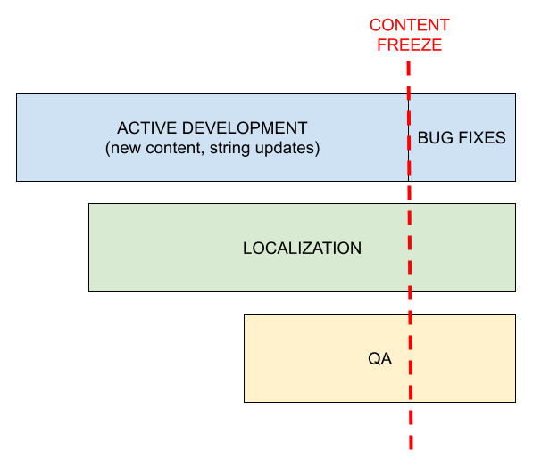

# Globalization best practices for product managers

<!-- toc -->

This document aims to describe a few of the common pitfalls when it comes to localizing products or websites, and it targets a less technical audience than [Localization best practices for developers](dev_best_practices.md).

The following content is also accessible to Mozilla staff (not public):
* For more detailed information about how we currently ship localized products, you can check out [this Confluence page](https://mozilla-hub.atlassian.net/wiki/spaces/FIREFOX/pages/11046419/Overview+and+distribution+of+localized+products).
* To understand how different content types are translated at Mozilla, you can check the [main Localization page on Confluence](https://mozilla-hub.atlassian.net/wiki/spaces/FIREFOX/pages/11045331/Localization+l10n+and+Translation#Localization(l10n)andTranslation-Standardlocalizationservicesbycontenttype).

## Planning

### Localization can’t be an afterthought

If you plan to ship a product in more than one language, **localization should be part of the initial planning**. In some cases, adding localization late in the cycle might be costly, as it could require going back to the drawing board for UX or content, or setting up additional infrastructure to ship a localized version of the product.

There are areas that represent non-obvious challenges when it comes to localization (physical addresses, phone number parsing and formatting, currency selection to name a few). If your application touches one of these aspects, the amount of work might not be trivial, and it will be too late to fix things.

### Which content needs to be localized?

Try to **think of all the assets that will be created** as part of the product, and how many will require localization. For example, shipping a localized mobile app isn’t just about localizing the app itself:
* Marketing content: is there promotional material that needs to be localized as part of launch or major update?
* Legal docs: are there new legal documents, or updates to existing ones, required for this project?
* App Store listings: is the project going to be published in online stores (Apple, Google, Microsoft)? Text requires localization, and images might need to be localized.

Stores are becoming common also for Desktop apps, so this applies to more and more products.

If you create **imagery** as part of these assets, make sure that they’re either fully localizable, or they’re sufficiently abstract (no text, no parts of actual product UI with text). Also, be mindful when adding pictures of people, make sure that the selection is inclusive and fits the target audience.

### Account for localization in your schedule

There are a few key moments in the schedule for a localized product:
* **Active development:** localization can start during this phase, and work in parallel with development (_continuous localization_). At this point, Nightly builds or automated screenshots should be already available to test localization in-context. While some churn in content can be expected at this stage, developers should still try to [avoid landing temporary content or placeholders](dev_best_practices.md#land-good-quality-strings).
* **Content freeze**: even with _continuous localization_, there must be a moment in the cycle when the content gets frozen, and stops receiving updates. This time after content freeze can be dedicated to complete and test localization.
* **QA:** Does QA need to test localized versions of the product? If so, this could only happen after the product has been localized.

The time needed to complete localization will depend on the size of content. When working with volunteers, it’s also important to understand that there’s no guarantee that localization will be completed by the end of the cycle:
* The localization implementation should be able to gracefully deal with incomplete localizations, i.e. **implement a robust fallback system**. For example, if a translation is missing for French, the app should keep working and display English content (i.e. the “source” content) only for that specific string.  \
Ideally, there should be a full chain of fallback locales, instead of just a pair: for example, for a minority language spoken in Mexico, a fallback chain that looks like language -> es-MX -> es-ES -> en-US provides a much better experience for users.
* Being able to **quickly ship localization updates** after the initial release is a major benefit, both for increasing localization coverage and fixing bugs.

### New feature ≠ new product

If a product is already localized, the new feature will inherit the same infrastructure, processes, and limitations of the main product (check this internal [Confluence page](https://mozilla-hub.atlassian.net/wiki/spaces/FIREFOX/pages/11046419/Overview+and+distribution+of+localized+products) for more details on some of Mozilla products).

For example, if you’re adding a new feature in Firefox:
* It will be localized by volunteers.
* Strings will be automatically exposed for localization once they land in Nightly.
* It will follow the rapid release cycle, with content frozen once it moves to Beta.

While possible, supporting a completely different workflow for a single feature requires time and work, and might not be cost or resource effective.

## Setting up for success

### Provide context

It doesn’t really matter if translation is performed by volunteers or by an external agency: **without context, they don’t have the tools to succeed**.

Providing context means, for example, explaining why a specific wording or term was chosen. What was the original intent? That reasoning would help localizers come up with the best option.

On a more technical level, providing context means explaining:
* Where is the string used, and are there technical limitations (e.g. limited space)? This typically happens through [localization comments](dev_best_practices.md#add-localization-notes).
* How can a feature be tested, or how can localized text be verified in context? **Screenshots** generated as part of automated tests go a long way in helping with this, as they don’t have any technical entry barrier, and require less time for localizers.

### Localization and volunteers are rarely the bottleneck

Using an external agency might feel like a good choice to ensure translations are done in time, especially when other parts of the project are late.

There are a few negatives to keep in mind:
* Translation delivery might happen quickly, but the content needs to be fed back into the existing infrastructure. Does that infrastructure support an external vendor?
* The agency might not have sufficient context or experience with the Mozilla ecosystem, and their work might not fit into the existing translations — or even our values.
* Fixing errors in translations might take a longer time to resolve, as the issue needs to be reported back in external tools, verified by translators, and then the fix imported back in the product.

### Working in the open by default

As mentioned above, localizers need context. This context is provided through open communications, while translations will be stored in tools and repositories that are publicly visible.

If the intent is to make a marketing splash with a new feature, keep this aspect in mind. There are ways to mitigate this, hiding some part of the information (e.g. launch dates) or sending 1:1 communications, but it can’t be a completely opaque process.

### Region ≠ language

It’s a **common mistake to think of languages and regions as interchangeable** (France = French). The easiest way to understand why that doesn’t work is thinking about a language like Spanish:
* It’s certainly spoken in Spain, but it’s the official language of several countries in South and Central America, and widely spoken in others (e.g. in the United States). Every regional variant will have different internationalization preferences (e.g. currency, or date formatting), but they might also use different expressions that could sound awkward to another demographic.
* By focusing only on Spanish for a product launch in Spain, you might be providing a less enjoyable experience for other users in the same region (Catalan, French, and speakers of other minority languages). This concept applies to most larger countries.

If you’re interested in knowing more about this topic, for example language distribution in a specific country, data from external research is available.

### Feature and brand names

Feature names are a particularly challenging aspect of localization, as often they use (or allude to) actual meaningful words in English.

The most important thing to establish early is a **clear policy for translation**: can the feature name be translated or transliterated, completely or partially, or should it stay in English?

Changing a feature name afterwards is confusing for users, so it’s important to establish a clear policy from the start, and understand that we shouldn’t change it afterwards. Imagine, as a user, to find a new feature in Firefox, and that name changes a couple of versions later. Confusing, isn't it? That happened for Firefox Account and Sync in the past, because we failed to satisfy the first requirement (or changed policy after years).

If the feature name can be localized, we need to provide as much context as possible on the choice, i.e. why that specific name was chosen for English.

We also need to give time to localizers to come up with a good choice. After all, the same process likely required a significant amount of time for English.

### Requesting a change for existing translations

As a product manager, you might receive feedback that a specific translation is not optimal and should be changed, or that English should be used instead of a translated term.

This section aims to provide more context about our work with the community, highlight aspects to keep in mind when evaluating this type of feedback, and describe how to effectively request a change.

#### Community

As detailed in [this Confluence page](https://mozilla-hub.atlassian.net/wiki/spaces/FIREFOX/pages/11045331/Localization+l10n+and+Translation#Localization(l10n)andTranslation-Standardlocalizationservicesbycontenttype), all Mozilla products are localized by a community of volunteers.

Our community members invest hundreds of hours translating the entire Mozilla ecosystem, and often do more than just translation: grass-root marketing, support, brand evangelism, QA, and more. We built a relationship based on cooperation over the years, and that includes trusting them with making good choices when it comes to translating specific feature names.

With the help of our community we established a sustainable localization system, which is key for Mozilla’s success and embodies our mission of making the internet truly accessible to all. Thanks to them, we’re often able to support more languages than our competitors.

#### Evaluating feedback and alternatives

The in-house Localization team acts as a **steward of the relationship with our community**. As a rule of thumb, feedback should not be forwarded unfiltered to translators. Feedback should be first evaluated internally:
* **Decide if the proposed change is worth the possible confusion that existing users will feel.** They have already been exposed to the existing translation, and all of a sudden the product will start using a different term, potentially one they don’t understand.
* **Explain why the new translation is considered more effective than the existing one.** Where possible, support the proposal with data.

The in-house Localization team should be the first point of contact. While we don’t have the internal resources to evaluate linguistic feedback for specific locales, we have more context on existing policies around translation, and can help identify all the risks associated with a change.

In an ideal scenario, we should rely on user research to understand how the target audience reacts to both alternatives. Looking at what other companies do can be an effective approach, but it’s important to note that they might target a completely different audience (age, interests, familiarity with English).

**Considerations when deciding whether an English term is best:**
* **We often have biases, because of age, environment or experience.** Mozilla is an international company where everyone speaks English. Most non-native speakers at Mozilla use their browser, operating system, and even mobile phone in English. As an employee, we might not be a representative sample when it comes to deciding if English is an effective choice.
* **Consider the product strategy and target audience.** Will we see better results with a more evocative and modern name (as English often is perceived), or a more descriptive translation that is more easily understood? For example, if the goal is to grow the number of users for the product through this feature, is there a risk that they might be pushed back by an English name? Or will they be more attracted?
* **Depending on the language, switching to an English term might not be a straightforward replacement**, e.g. if the term is used in sentences and with different grammatical roles.
* **English might have a negative impact on specific languages and cultures.** For example, consider languages using a different [text direction](https://en.wikipedia.org/wiki/Bidirectional_text): in right-to-left languages, the text flows from right to left. An English set of words will force the reader to suddenly jump forward, read the characters left to right, then return to the natural reading flow for the rest of the sentence. While this has become second nature for younger generations, it might not be for all speakers, or even for all regions where the language is spoken.  The English words might also be pronounced in a way that evokes existing words in the local language, giving the feature a negative or even obscene connotation. There are plenty of examples of major international companies rebranding locally to avoid this type of situation.

#### How to request a change

The localization program manager in charge of the product can reach out to a specific language community to get more background on existing translations, for example to verify if alternatives were already considered and rejected.

Our team can also create a communication channel between product and localizers to propose a change, but simply imposing a specific choice from the top comes with the risk of alienating our volunteers.
