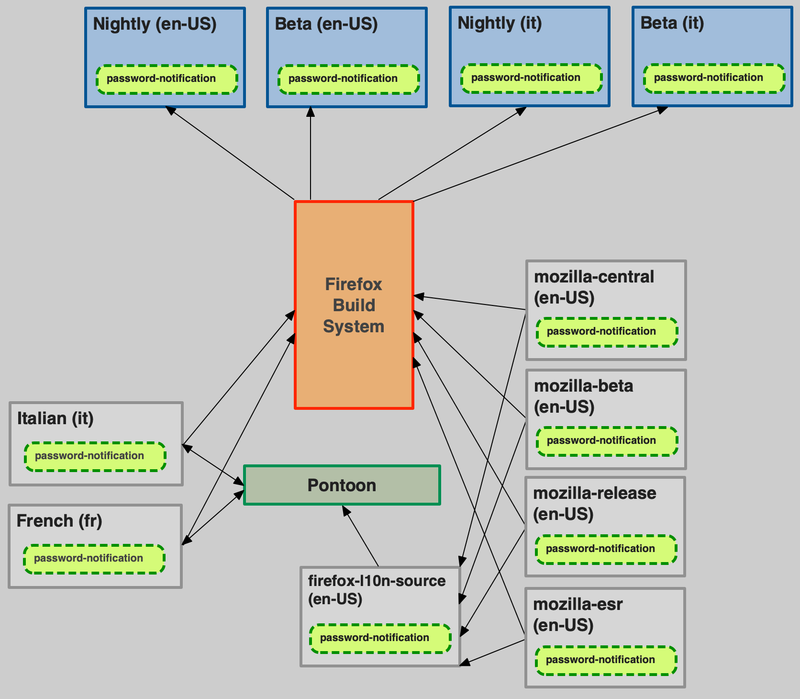
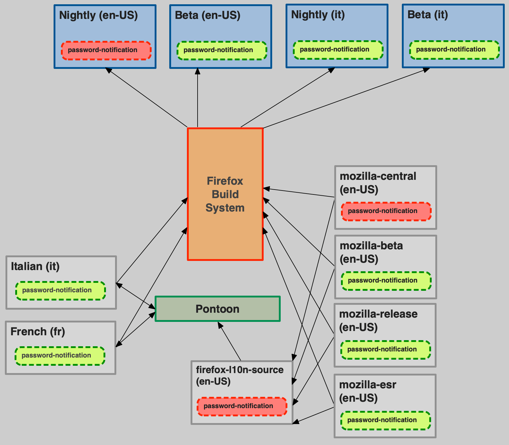
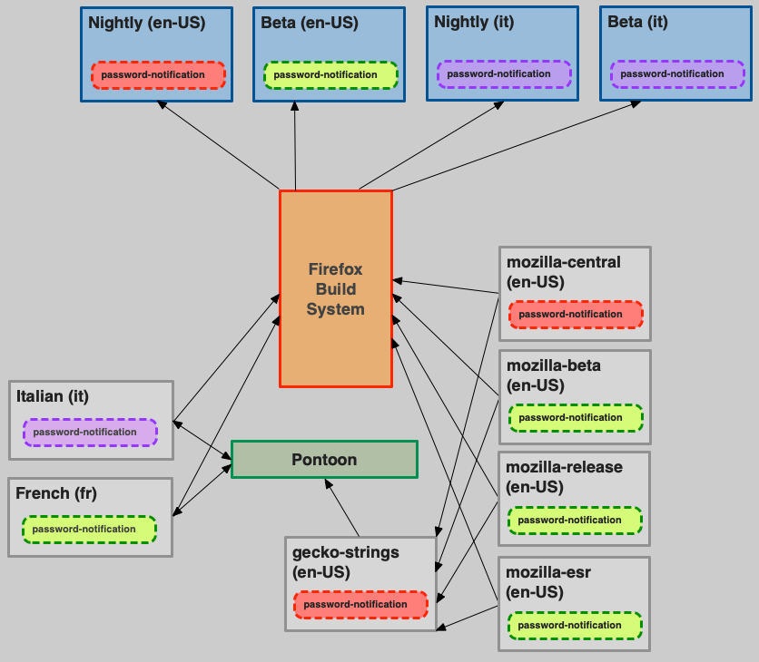

# Making changes to existing strings

## String identifiers

In most localization formats, a translation unit consists of a unique identifier (ID, often *string ID* or *message ID*) associated to a segment of text. For example, in the following Fluent snippet, the text `Cancel` is stored in a message with ID `cancel-button`.

```
cancel-button = Cancel
```

The same concept applies to legacy formats like DTD or properties, or XML in Android.

```XML
    # DTD
    <!ENTITY cancelButton "Cancel">

    # Android XML
    <string name="cancel_button">Cancel</string>
```

## General guidelines

These are the general guidelines to follow when updating existing strings already exposed for localization:
* If you are changing a string such that its **meaning has changed**, you must update the string ID.
* In case of Fluent, you need to update the string ID also when **the morphology of the message changes**, i.e. attributes are added or removed.
* If your changes are relevant only for English — for example, to correct a typographical error or to make capitalization consistent — then there is generally no need to update the string ID.

There is a gray area between needing a new ID or not. In some cases, it will be necessary to look at all the existing translations to determine if a new ID would be beneficial. You should always reach out to the l10n team in case of doubt.

As for which new ID to use, versioning – adding a number, e.g. `cancel-button2` – should be only used as a last resource when better IDs are not available.

When updating IDs, make sure to also update references to the old ID in both existing code and comments.

## Why is it necessary to use new IDs?

This is very specific to how localization works at Mozilla, and mostly depends on two key elements:
* String IDs (and not their values) are used to identify strings throughout the entire localization toolchain.
* Translations stored in Version Control Systems (e.g. GitHub) are treated as the **source of truth**.

Changing the message ID will invalidate existing translations, the new message will be reported as missing (new) in all tools, and localizers will have to retranslate it. This is the only reliable method to ensure that localizers update existing localizations, and run-time stops using obsolete translations.

### Generic localized product

Let’s consider the simplest scenario for a localized product, using a single repository for storing both the source locale (en-US) and other localizations.

```
password-notification = Please enter your master password
```

This message needs to be updated to `Please enter your primary password`. This is the type of change that we want to be reflected in all locales, so we create a new string, with a different ID:

```
primary-password-notification = Please enter your primary password
```

The localization toolchain considers this a brand new string and notifies localizers that it requires translation. Pontoon leverages the prior translation, so that the localizer only has to translate the diff (e.g., “Please enter your password” would be leveraged, the localizer would only need to add “primary”). The downside, however, is that it requires more work for developers to update references in code.


The picture above shows a snapshot of the situation before the string change:
* Both source strings (en-US) and localizations are stored in a single repository. For simplicity, only two locales are displayed (French and Italian).
* The string with its translations is also stored in our internal localization tool, [Pontoon](https://pontoon.mozilla.org/).
* The build system is using the content stored in the localization repository to build localized versions of the product. At run-time, code is going to query the string with ID `password-notification`, and show the available translation or fall back to English if that’s missing (the fallback logic and its complexity heavily depends on the product).

Note that this is still a simplification of a real-life product:
* The `en-US` content would be exported periodically from the product’s code repository.
* Both localization and code repositories would be used to build and deploy.
* Pontoon only reads the source locale, but can both read and write localizations.

What happens if we change the message without using a new string ID?

```
password-notification = Please enter your primary password
```


At this point:
* The en-US product will start using the new message (in red) right away.
* Pontoon will read the updated message, but won’t invalidate existing translations (in green) or notify localizers. Remember that there are cases, e.g. fixing typos, where this is a desired behavior.
* The l10n repository will keep storing older translations (in green), although they are likely obsolete at this point.
* Both run-time and build system won’t know anything about the different versions of this string, they won’t be able to differentiate values that were updated from those that are obsolete and use that information for the fallback logic.

As explained before, at Mozilla the VCS is the source of truth, and it can be accessed directly by localizers, or by tools other than Pontoon. As a consequence, as you can see from the picture, the sync between Pontoon and l10n repositories needs to be bidirectional: new translations are written by Pontoon in the l10n repository, but Pontoon also reads changes made to the repository. The latter is quite common in Firefox, for example when we run [Fluent migrations](../products/firefox_desktop/fluent_migrations.md).

In this scenario, the only way to ensure that obsolete translations are ignored by the entire toolchain is to change string IDs. The alternative would be gating access to the repository, allowing only translation via Pontoon, and automatically remove all obsolete translations as soon as the source locale changes. It’s worth noting that this approach might prevent us from shipping localization updates for a previous version of the product (in the example, one where *master password* is still in use).

### Firefox

Things become a lot more complicated for Firefox:
* The `en-US` locale is stored in the code repository (e.g. `mozilla-firefoxl`). That locale is used by the build system to build the US English version of Firefox, but it’s not used as source by the localization toolchain. In fact, in order to ship all versions of Firefox (Nightly, Beta, Developer Edition, Release, ESR) from a single l10n repository, we rely on a special unified [repository](https://https://github.com/mozilla-l10n/firefox-l10n-source) in GitHub called `firefox-l10n-source`, which includes all strings for all shipping versions of Firefox.
* Localizations are stored in a separate repository (`firefox-l10n`) from source strings.

This is the scenario before the string change. Once again, although it already looks very busy, it’s a simplified high level view of the actual system.



And this is what happens if a string is changed without new ID:



* The string is changed in `mozilla-firefox`, and the en-US Nightly build will start using it. This change is reflected in `firefox-l10n-source`, but doesn’t impact other builds (e.g. beta), because that’s not used by the build system.
* As for the generic product, Pontoon reads the updated change, but doesn’t notify localizers or invalidate existing translations.

In this scenario, simply removing existing translations from VCS isn’t possible, because we still need them to ship in older builds.

Let’s take it a step further, and assume that we can detect the change, notify localizers in Pontoon, and Italian updates its translation (in purple).



As you can see, this would result in shipping the updated version of the string in all builds, including ones where *master password* is still used.

### That’s not how it work in other companies or products

True, Mozilla’s approach to localization is unique, as much as our Mission to ensure openness. Most companies, for example, can treat their internal localization tool as source of truth, gate access, and use VCS only as a write-only storage. In that case, they can directly remove obsolete translations from VCS, or keep track safely of strings that need to be reviewed following changes to the source language. They also can enforce schedules and timelines, since localization is managed by either staff or vendors, while at Mozilla is managed by a community of volunteers.

Adopting this type of approach at Mozilla would require a drastic change of paradigm, including closing down access to repositories, and a significant investment in updating the existing toolchain.
