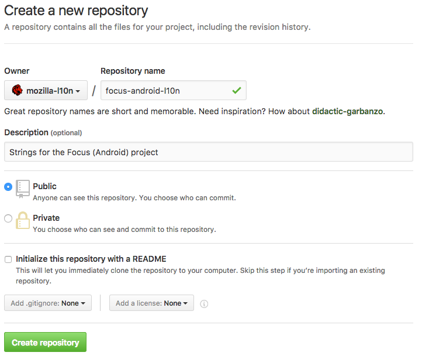

# Creating a new repository for projects

Creating a new repository in the [mozilla-l10n](https://github.com/mozilla-l10n) organization provides the advantage of letting l10n-drivers manage this repository directly, reducing delays when dealing with permissions. It also allows localizers to work directly on GitHub with pull requests.

Note that you need to be a manager of the organization in order to create a new repository.

## Create the new repository

A new repository can be created in [this page](https://github.com/organizations/mozilla-l10n/repositories/new), or using the **New** button in the organization’s landing page.

**Name**: always include the `-l10n` suffix for localization repositories, to differentiate them from other repositories used for tools. Notable exception to this rule is `www.mozilla.org`.

For example, if the project is *Focus for Android*, a good repository name is `focus-android-l10n`.

**Description**: add a short description, e.g. `Strings for the Focus (Android) project`.

Set the project as **Public** and don’t initialize it with a README.



## Add collaborators

Go into the project settings, panel **Collaborators & teams**:

* Add the relevant l10n-drivers as Admin. You can either pick individuals or one of the pre-existing groups.
* Only when the project is ready for localization, add the **Localizers** group with **Write** permissions. Note that Pontoon’s bot is included in the localizers group, so you will need to enable it for testing the sync process.
* Add relevant developers as contributors if they need to make commits to the repository (that’s usually the case, in order to update strings).


## Add a README.md to the project

Add a README with some useful information about the project. For example, for Focus for Android:

```
# Focus by Firefox localization
Localization for the Focus by Firefox project for Android.

The application code with build instructions can be found
at <https://github.com/mozilla-mobile/focus-android>.

# License
Translations in this repository are available under the
terms of the [Mozilla Public License v2.0](https://www.mozilla.org/MPL/2.0/).
```

## Add a CODEOWNERS file

It’s possible to add a *CODEOWNERS* file to automatically ping the owner of the project in case of pull requests. File should be placed in the root of the repository, it’s called `CODEOWNERS` and uses the following format:

```
path/to/files/to/monitor @nickname_of_owner
```

For example, this is the content of the [CODEOWNERS](https://github.com/mozilla-l10n/focus-android-l10n/blob/master/CODEOWNERS) file for Focus for Android:

```
locales/templates/*.pot @delphine
```

Pull requests to update strings always modify `locales/templates/app.pot`, while `delphine` is the nickname of the PM in charge of this product. Any pull request trying to modify files matching that path will automatically send a review request to the code owner.

## Add topics to the repository (optional)

In the main repository page you can add [topics](https://github.com/blog/2309-introducing-topics) to make the repository more discoverable by potential contributors. For example, all localization projects have the following topics: mozilla-l10n, localization, translation.
