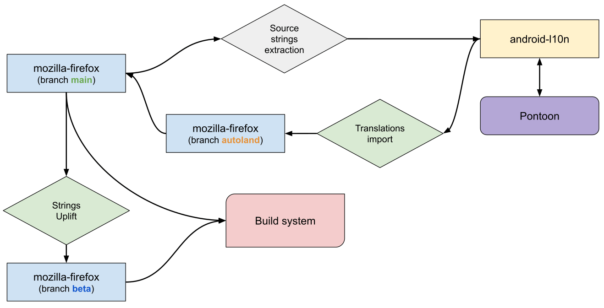

# Adding a new project to android-l10n

Follow the steps below to add new projects to [android-l10n](https://github.com/mozilla-l10n/android-l10n). You will have to coordinate with Android developers, release engineers, and a technical Localization EPM throughout the process.

## Setting up the project in source and l10n repositories

Before anything happens, check that the new project is properly localizable by following the directions in [this section](https://github.com/mozilla-l10n/documentation/blob/main/src/tools/pontoon/adding_new_project.md#adding-a-new-project-on-pontoon). Once the new project exists in its corresponding source repository and is ready, it can then be added to the `android-l10n` repository.

Android developers need to create a TOML file in their code directory and under its corresponding project folder ([example for fenix](https://github.com/mozilla-firefox/firefox/blob/main/mobile/android/fenix/l10n.toml)), as well as the file containing the source strings in `res/values/strings.xml` ([example for fenix](https://github.com/mozilla-firefox/firefox/blob/main/mobile/android/fenix/app/src/main/res/values/strings.xml)). The `mobile/android` directory in `mozilla-firefox` contains all [current Android projects](https://github.com/mozilla-firefox/firefox/tree/main/mobile/android).

The TOML file should be pre-populated with a list of locales. When a new project is announced, you typically reach out to localizers on existing communication channels, so they can opt in their locale. If the Android project shares strings with `android-components`, then you need to first make sure the locale code is already listed under its corresponding [TOML file](https://github.com/mozilla-firefox/firefox/blob/main/mobile/android/android-components/l10n.toml). If not, it will need to be added there as well.

Localized files are stored in GitHub under the [android-l10n repository](https://github.com/mozilla-l10n/android-l10n). A GitHub [workflow](https://github.com/mozilla-l10n/android-l10n/tree/main/.github/workflows) is used to automatically extract source strings and TOML files from [`mozilla-firefox`](https://github.com/mozilla-firefox/firefox).

TaskCluster is used to import translations and TOML files to the [`autoland`](https://github.com/mozilla-firefox/firefox/tree/autoland) branch in `mozilla-firefox`, then code sheriffs merge new translations to the `main` branch together with other code changes. This allows sheriffs to back out updates with errors that break Android builds. TaskCluster is also used to uplift strings from the `main` branch to `beta`. For new projects, sync with release engineers to make sure that the automation to import strings for this project has been added.

On the `android-l10n` repository side, you will need to set up [automation](https://github.com/mozilla-l10n/android-l10n/tree/main/.github/workflows) to import strings and TOML files from the code repository. This automation will be responsible for creating all needed files in the repository. You may need to sync up with a technical localization EPM to set this up.

Once automation is in place, it will automatically extract new English strings and configurations from the code repository. It should also be possible to invoke automation [manually](https://github.com/mozilla-l10n/android-l10n/actions).

## Add and manage the project in Pontoon

Once all of this is done and merged, you can now enable the new project in Pontoon (see [instructions for adding new projects](https://github.com/mozilla-l10n/documentation/blob/main/src/tools/pontoon/adding_new_project.md#create-the-project)).

Going forward, remember to update the localization completion deadline under Pontoon resources. For existing Android projects, the deadline falls one day before the *Release Candidate* date of the current [Beta version](https://whattrainisitnow.com/release/?version=beta). They follow the same four-week release cycle as other Firefox browsers, so these deadlines must be updated regularly. When setting up a new project, confirm what type of release cycle it will follow. To update, navigate to the [Pontoon admin](https://pontoon.mozilla.org/admin/) page, select your project, and update the *Target date*.
