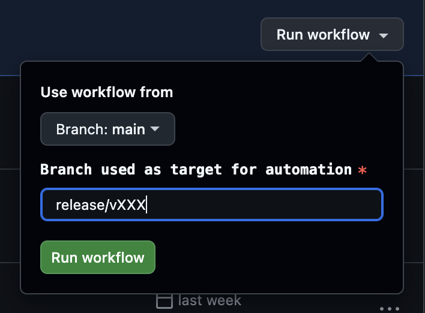

# Firefox Mobile L10N FAQs

This document includes a series of frequently asked questions about Firefox mobile localization across platforms. While it is primarily intended for developers, it also provides valuable context for product managers and engineering program managers.

If you don't see your question addressed here, check also the main [Firefox L10n FAQ](../firefox_desktop/firefox_l10n_faqs.md) or look into our Developer best practices [documentation](https://mozilla-l10n.github.io/documentation/localization/dev_best_practices.html). You’re also welcome to file an [issue](https://github.com/mozilla-l10n/documentation/issues) so we can add your question to this FAQ.

## General

### Who can I contact if I have more questions?

A Program Manager (Localization ePM) is assigned to any Mozilla project that is localized through community. You can find this information in [Pontoon](https://pontoon.mozilla.org/projects/firefox/) for any project in the header section, and more information about the localization team is available in the Confluence page dedicated to [Localization](https://mozilla-hub.atlassian.net/wiki/spaces/FDPDT/pages/11045331/Localization+l10n+and+Translation) (available to Mozilla staff only).

### [Should I enable my feature only for English, or ship it in English for everyone?](../firefox_desktop/firefox_l10n_faqs.md#should-i-enable-my-feature-only-for-english-or-ship-it-in-english-for-everyone)

## Builds and distribution

### How can users get localized builds?

Unlike [Firefox desktop](../firefox_desktop/firefox_l10n_faqs.md#how-can-users-get-localized-builds), we ship multilingual builds by default and users can simply switch language from within the app for Android or through the OS settings for iOS.

## Schedule and release cycle

### I landed strings in my mobile source repository, when are they going to be localized?

#### Android

It takes roughly 48h between when strings land in the source repository, are reviewed by a member of the [android-l10n-reviewers](https://phabricator.services.mozilla.com/tag/android-l10n-reviewers/) group via Phabricator, then extracted to the localization repository.

Once the strings have landed in the localization repository, the mobile localization ePM then needs to review the strings one more time, and merge the pull request so strings will be exposed on Pontoon. This usually adds an extra 24h.

Once the strings are exposed on [Pontoon](https://pontoon.mozilla.org/), localizers can begin working on them right away. It will then take at least another 24h for strings to get back into the source repository, and be included in the next build.

However, since our contributors are volunteers, it's important to keep in mind that while many locales are active and responsive we can’t always expect full localization coverage for every release.

#### iOS

There is [automation](https://github.com/mozilla-l10n/firefoxios-l10n/blob/main/.github/workflows/import_strings.yml) running every Tuesday to import strings that landed in the source repository into the localization repository (it’s also possible to invoke it manually). The localization ePM then reviews the strings, which can take roughly 48 to 72h depending if there are any issues to fix (it might require some back and forth with developers). Once the pull request is merged in the localization repository, strings will be exposed on [Pontoon](https://pontoon.mozilla.org/) and localizers can start working immediately. Automation will import localizations back to the source repository every Monday ([automation](https://github.com/mozilla-mobile/firefox-ios/blob/main/.github/workflows/firefox-ios-import-strings.yml) for Firefox for iOS, [automation](https://github.com/mozilla-mobile/firefox-ios/blob/main/.github/workflows/focus-ios-import-strings.yml) for Focus for iOS). It’s also possible to invoke automation manually.

Again, since our contributors are volunteers, it's important to keep in mind that while many locales are active and responsive we can’t always expect full localization coverage for every release.

### Can I uplift a patch to Beta or Release?

While Nightly is always open for new strings, Beta and Release are string frozen, meaning that patches with new strings are normally not allowed to land.

Uplifts need to be evaluated case by case, but in general they should be avoided in the context of a [4-week release cycle](../firefox_desktop/build_system.md). Possible alternatives are uplifting ad-hoc patches without string changes, or exposing the feature/change only to English users.

One more thing to consider is the timing of the uplift. The last week of the Beta cycle is frozen (after Release Candidate [is built](https://whattrainisitnow.com/release/?version=beta)), meaning that we can’t take any updates to localization and ship it in that version. Anything uplifted close to the deadline, or after, will ship untranslated. Always flag the Localization ePM for feedback in the case the patch introduces strings. In the case the uplift is accepted, you can follow the steps below and depending on the product.

#### Firefox for iOS / Focus for iOS

1. The iOS developer creates a backport of the pull request adding that string into the release branch.
2. Once that's merged, they run a GitHub action ([Firefox](https://github.com/mozilla-mobile/firefox-ios/actions/workflows/firefox-ios-import-strings.yml), [Focus](https://github.com/mozilla-mobile/focus-ios/actions/workflows/firefox-ios-import-strings.yml)) to import strings toward that specific release branch (see screenshot).
3. Then once merged, the translations for that string should be part of that beta/release.

#### Firefox for Android / Android-Components / Focus for Android

[Automation](https://searchfox.org/mozilla-central/rev/16abc60460bd25e02750da8842a1e914bc738afb/.cron.yml#411-418) runs every day and copies translations from [`android-l10n`](https://github.com/mozilla-l10n/android-l10n/) to [autoland](https://hg.mozilla.org/integration/autoland/). Another [job](https://searchfox.org/mozilla-central/rev/16abc60460bd25e02750da8842a1e914bc738afb/.cron.yml#420-427) copies translations from main to beta, also every day.

In order to uplift a patch with string changes to release, developers will also need to manually uplift all the relevant translation files to the `release` branch (there is no automation).

### I need to add new strings for version X: when is the deadline?

For both Firefox for Android and Firefox for iOS, there is time from the beginning of Nightly to String Freeze date to land strings in the mobile source repositories. The sooner you land content, the higher will be the chances that the content will be localized in several languages before reaching release.

Make sure to check the [release schedule](https://whattrainisitnow.com/) to see the relevant dates and additional details.

## Development

### [Where can I find guidelines for developers?](https://mozilla-l10n.github.io/documentation/localization/dev_best_practices.html)

### Where can I find the localized strings?

Note that while Firefox for Android and Focus for Android both live under the same `android-l10n` repository, Firefox for iOS and Focus for iOS live under two separate repositories (see below for more details).

We also have locales that have different codes between Pontoon and the repository for Android.

#### Firefox for Android (comprised of Fenix and Android-Components) and Focus for Android

All localized files for Fenix, Android-Components and Focus live in the `mozilla-l10/android-l10n` repository, under [this folder](https://github.com/mozilla-l10n/android-l10n/tree/main/mozilla-mobile). As an example, [this](https://github.com/mozilla-l10n/android-l10n/tree/main/mozilla-mobile/focus-android/app/src/main/res) is where the French `strings.xml` translations for Focus would be found (under [values-fr](https://github.com/mozilla-l10n/android-l10n/tree/main/mozilla-mobile/focus-android/app/src/main/res/values-fr)).

The locale folder will be displayed as \`values-{locale code}\`, and you will have an extra "r" for locales with hyphens (for example es-AR in [values-es-rAR](https://github.com/mozilla-l10n/android-l10n/tree/main/mozilla-mobile/fenix/app/src/main/res/values-es-rAR)).

We also have some locale codes different for some folders: Hebrew is found under [values-iw](https://github.com/mozilla-l10n/android-l10n/tree/main/mozilla-mobile/fenix/app/src/main/res/values-iw) and Indonesian falls under [values-id](https://github.com/mozilla-l10n/android-l10n/tree/main/mozilla-mobile/fenix/app/src/main/res/values-in).

#### Firefox for iOS

Localized [files](https://github.com/mozilla-l10n/firefoxios-l10n). Each locale will have its own folder with one XLIFF file for the entire app.

#### Focus for iOS

Localized [files](https://github.com/mozilla-l10n/focusios-l10n). Each locale will have its own folder with one XLIFF file for the entire app.

### Should I remove obsolete or unused strings?

Yes. Removing obsolete or unused strings keeps source code clean and easier to maintain, while also improving the localization process. When deprecated strings remain in the project, localizers may spend valuable time translating or reviewing content that’s no longer in use — leading to wasted effort. By cleaning up unused strings, you ensure translators can focus on what truly matters: relevant, user-facing content. The links below will explain how to ensure you are correctly removing strings:

* [Documentation](https://firefox-source-docs.mozilla.org/mobile/android/focus-android/Removing-strings.html#removing-strings) for Android
* [Documentation](https://github.com/mozilla-mobile/firefox-ios/wiki/How-to-add-and-modify-Strings#how-to-remove-a-string) for iOS

Note that for both products, you must mark a string as "unused" rather than deleting it directly. This ensures the string stays available for versions where it’s still in use. The links above explain this process in further detail.

### When should “Mozilla” or “Firefox” brand be hardcoded?

We don’t usually hardcode brand names, but this can happen in some edge cases.If in doubt, reach out to the current localization mobile ePM or on the Slack #l10n channel.

Hardcoding brand names in strings can cause problems in case the brand name changes. Instead, developers should use placeholders and replace them at run-time with the expected brand name. This makes it easier to update them in one place and keeps string files cleaner and more flexible for translation workflows. Among other things, it allows forks and repackaged versions of Firefox to use their own branding without editing hundreds of strings, and losing existing translations.

One reason to use hardcoded brand names is when you always want the text to mention that specific brand name, e.g. Mozilla or Firefox. One example is telemetry, as shown in this [issue](https://github.com/mozilla-l10n/focusios-l10n/pull/119#discussion_r1919628152): if telemetry is enabled, the data is always sent to Mozilla, not to a fork’s third-part vendor.

### When do I have to use a different ID when updating existing strings?

[This document](https://mozilla-l10n.github.io/documentation/localization/making_string_changes.html#general-guidelines) explains in details why and when it is necessary to use new string IDs when updating existing strings. As a general guideline:

* If you are changing a string such that its **meaning has changed**, you must update the string ID. That will force retranslation in Pontoon across all locales.
* If your changes are relevant only for English — for example, to correct a typographical error or to make capitalization consistent — then there is generally no need to update the string ID.

### Plural support

We do not handle [proper plural support](https://mozilla-l10n.github.io/documentation/localization/dev_best_practices.html#use-proper-plural-forms) for mobile yet. For this reason, you should try to use plural neuter expressions, where there isn’t a noun associated to the number: for example, instead of `%S files were copied`, use `Copied files: %S`.

If in doubt reach out to the current localization mobile ePM or on the Slack #l10n channel.

### Use localization notes and avoid using comments as development notes

Localizers typically see one string at a time, without access to the full source code or interface. As a result, they may struggle to understand the meaning or context of a string.

Notes targeting developers can be unclear or overly technical — rather than giving context which would be most helpful for translation. To support accurate and meaningful translations, it’s essential to include clear, concise, and context-rich comments specifically written for localizers.

These comments are generally referred to as *localization notes*. Please read more about this in our [best practices guide](https://mozilla-l10n.github.io/documentation/localization/dev_best_practices.html#add-localization-notes%20).

## Translation completion and community

### [Is my feature going to be localized in language X before launch?](../firefox_desktop/firefox_l10n_faqs.md#is-my-feature-going-to-be-localized-in-language-x-before-launch)

### I see pending suggestions in Pontoon, how can I get them approved?

Reach out to the current localization mobile ePM or on the Slack #l10n channel.
