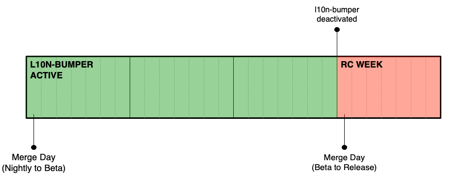
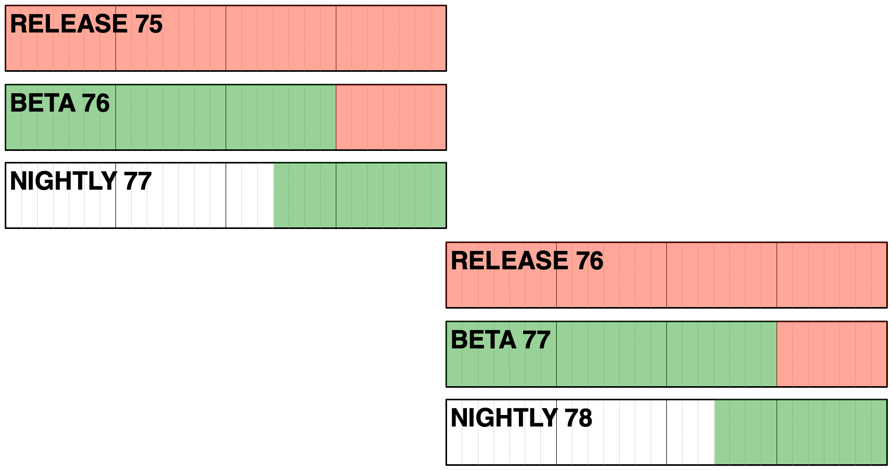

# Build system details for Firefox desktop

<!-- toc -->

## Overview

Thanks to [cross-channel](https://firefox-source-docs.mozilla.org/l10n/crosschannel/index.html), we ship all versions of Firefox from a [single localization repository](https://hg.mozilla.org/l10n-central/), but each channel uses a different snapshot in time of that repository.

 A job, called `l10n-bumper`, runs on Taskcluster every hour, and stores information on the l10n changesets to use for each build in a file called `l10n-changesets.json`:
* For Nightly (`mozilla-central`), [l10n-changesets.json](https://hg.mozilla.org/mozilla-central/file/default/browser/locales/l10n-changesets.json) always uses the revision `default`, and it’s only updated when changing the locales available in the build.
* Beta builds (`mozilla-beta`) still use the tip of the l10n repository, but the actual hash is stored in [l10n-changesets.json](https://hg.mozilla.org/releases/mozilla-beta/file/default/browser/locales/l10n-changesets.json) instead of `default`.
* Before Release Candidate week, the `l10n-bumper` is [manually stopped](https://github.com/mozilla/build-relengdocs/blob/master/procedures/release-duty/merge-duty/merge_duty.rst#turn-off-beta-l10n-bumper-on-rc-day) on `mozilla-beta`. Since the configuration change lands only on `mozilla-beta`, the `l10n-bumper` will automatically restart at the beginning of the next cycle, when the standard configuration is uplifted from `mozilla-central`.
* When the Beta code is merged to Release, [l10n-changesets.json](https://hg.mozilla.org/releases/mozilla-release/file/default/browser/locales/l10n-changesets.json) moves together with the rest of the code to `mozilla-release`. That means that Release builds will use the same changesets as the last beta with the same version number, and any further change [requires code uplifts](#updating-release).

## Timeline and deadlines

This is how Beta looks like in a 4 weeks release cycle, with relevant milestones.

On Monday, 8 days before the release, the `l10n-bumper` will stop updating `l10n-changesets.json` on `mozilla-beta`.

Once the code merges from Beta to Release, any changeset update would require a manual uplift to `mozilla-release` and a new Release Candidate (RC) build.

### Updating release

When the code moves from `mozilla-beta` to `mozilla-release`, `l10n-changesets.json` is frozen, as `l10n-bumper` is not configured to run against the release branch.

In case of severe issues affecting one or more locales, it’s still possible to manually update the shipping changesets. A patch needs to be provided for `l10n-changesets.json` in `mozilla-release` branch and approved for uplift by Release Drivers (see for example [this bug](https://bugzilla.mozilla.org/show_bug.cgi?id=1513259) and [associated patch](https://hg.mozilla.org/releases/mozilla-release/rev/308fd26a204e)). Note that a dot release is needed in order to ship the updated version to users.

The same process applies to ESR versions, as long as the associated esr repository is included in the [current version of cross-channel](https://hg.mozilla.org/users/axel_mozilla.com/cross-channel-experimental/file/tip/initial/cli/_config.py).
