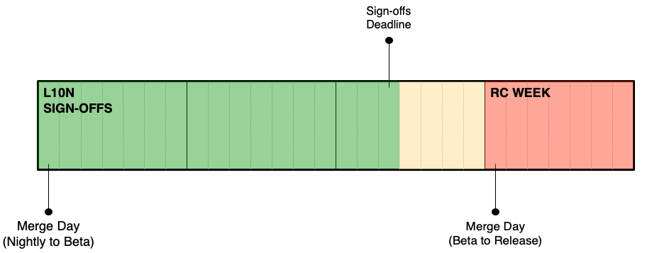
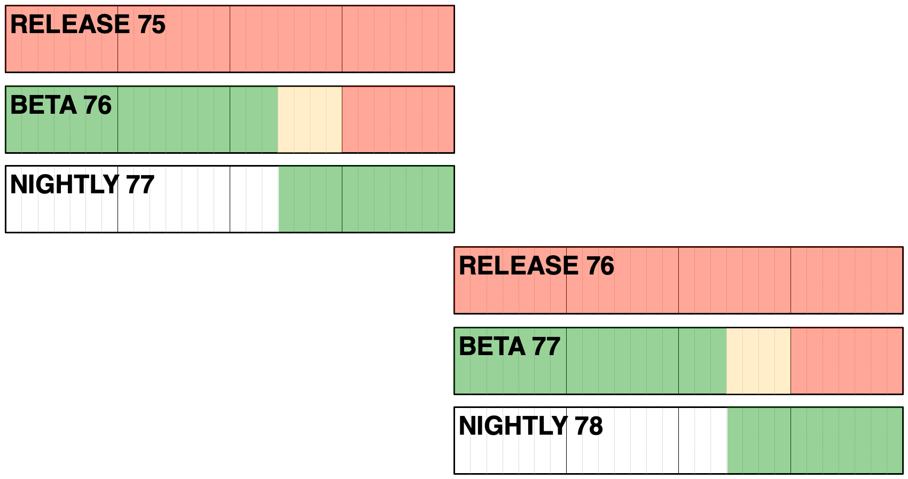
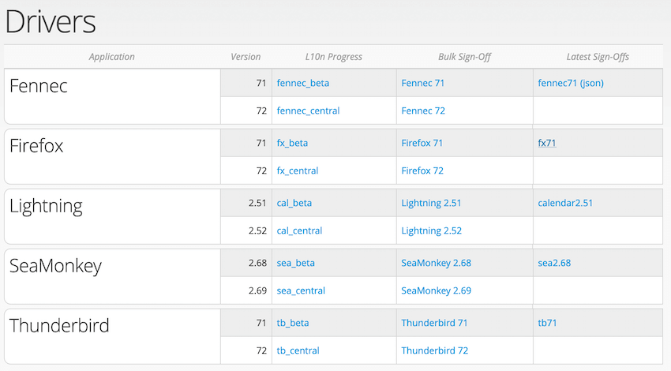
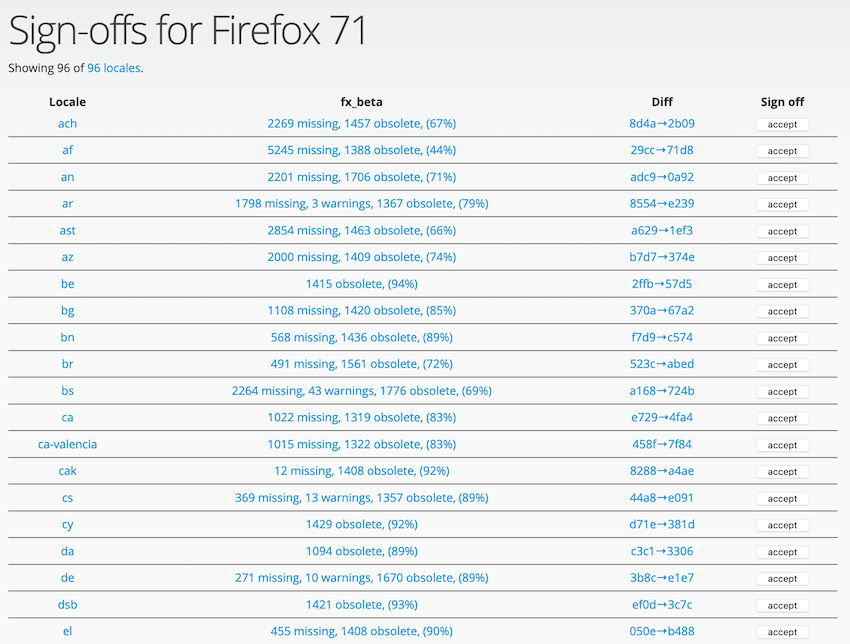

# Sign-offs for Firefox desktop and Firefox for Android

<!-- toc -->

## Overview

Sign-offs are a way for l10n-drivers to indicate that a specific changeset is technically sound and ready to ship to general audience in Firefox (Beta, Release). Currently, thanks to [cross-channel](https://firefox-source-docs.mozilla.org/l10n/crosschannel/index.html), we ship all versions of Firefox from a [single localization repository](https://hg.mozilla.org/l10n-central/), but each channel uses a different snapshot in time of that repository.

While sign-offs are performed on l10n.mozilla.org (*Elmo*), the resulting data is stored in each tree (`mozilla-central`, `mozilla-beta`, etc.) to be used directly by the build system. A job, called `l10n-bumper`, runs on Taskcluster every hour, retrieves sign-off information from Elmo via API, and stores it in a file called `l10n-changesets.json`:
* For Nightly (`mozilla-central`), [l10n-changesets.json](https://hg.mozilla.org/mozilla-central/file/default/browser/locales/l10n-changesets.json) always uses the revision `default`, and it’s only updated when changing the locales available in the build. That means that Nightly builds always use the tip of the l10n repository, i.e. the latest changes available for each locale.
* Beta builds (`mozilla-beta`) only use the signed off changesets for each locale. Unlike in `mozilla-central`, [l10n-changesets.json](https://hg.mozilla.org/releases/mozilla-beta/file/default/browser/locales/l10n-changesets.json) contains the changesets signed off in Elmo instead of `default`.
* When the Beta code is merged to Release, [l10n-changesets.json](https://hg.mozilla.org/releases/mozilla-release/file/default/browser/locales/l10n-changesets.json) moves together with the rest of the code to `mozilla-release`. That means that Release builds will use the same changesets as the last beta with the same version number, and any further change [requires code uplifts](#updating-release).

## Timeline and deadlines

This is how Beta looks like in a 4 weeks release cycle, with relevant milestones.

Sign-offs on Beta are not possible through the entire cycle: sign-offs deadline is on Wednesday, about 2 weeks before the release, to allow time for at least one more Beta build before the end of the cycle.

While it’s still possible to take last minute sign-offs during the rest of the third week, for example to fix bugs or improve coverage for tier 1 languages. that comes with increased risk, since there will be no time for another beta build to test these changes. Once the code merges from Beta to Release, any sign-off update would require a manual uplift to `mozilla-release` and a new Release Candidate (RC) build.

Given that the Beta version is closed to sign-offs for more than 10 days, to avoid accumulating a lot of review backlog, the PM in charge can decide to take sign-offs on the [Nightly version](https://l10n.mozilla.org/shipping/dashboard?tree=fennec_central&tree=fx_central) for the remaining part of the cycle.

As explained at the beginning, sign-offs are not used for Nightly builds, but this approach has a few benefits:
* It reduces the content to review at the beginning of the Beta cycle. That’s particularly important when it comes to the amount of changes generated for Firefox desktop by [Fluent migrations](../firefox_desktop/fluent_migrations.md).
* Since sign-offs are tied to a version number, when Nightly moves to Beta, the new Beta version will already have updated sign-offs and won’t fall back to outdated changesets. As a consequence, the first beta of the cycle will ships with better l10n coverage. In the example above, you start taking sign-offs for 77 at the end of the Nightly cycle. When 77 moves to Beta, it will already have update content compared to the last 76 sign-offs.

### Updating release

When the code moves from `mozilla-beta` to `mozilla-release`, `l10n-changesets.json` is frozen, as `l10n-bumper` is not configured to run against the release branch, and Elmo doesn’t allow to sign off changesets on the release channel.

In case of severe issues affecting one or more locales, it’s still possible to manually update the shipping changesets. A patch needs to be provided for `l10n-changesets.json` in `mozilla-release` branch and approved for uplift by Release Drivers (see for example [this bug](https://bugzilla.mozilla.org/show_bug.cgi?id=1513259) and [associated patch](https://hg.mozilla.org/releases/mozilla-release/rev/308fd26a204e)). Note that a dot release is needed in order to ship the updated version to users.

The same process applies to ESR versions, as long as the associated esr repository is included in the [current version of cross-channel](https://hg.mozilla.org/users/axel_mozilla.com/cross-channel-experimental/file/tip/initial/cli/_config.py).

## How to perform sign-offs

[This page](https://l10n.mozilla.org/shipping/dashboard?tree=fennec_beta&tree=fx_beta) only includes sign-offs for Firefox desktop (`fx_beta`) and Firefox for Android (`fennec_beta`) beta.

A green checkmark is displayed in the *Status* column if the locale has a sign-off, while it’s empty if there are no sign-offs. This only happens for brand new locales that are only shipping in Nightly.

The *Action* column can display several icons:
* A prohibited icon indicates that there is no activity after the last sign-off (belonging to a previous version), and therefore it’s not possible to do an updated sign-off.
* A sparkline icon indicates activity that should be checked:
    * Green indicates that the translation is complete (no error, no missing strings).
    * Orange means that the product is still incomplete.
    * Red means that there are errors in the localization. The number of errors and warnings is also reported within the table.

To perform the sign-off, click on the sparkline icon. It will open a new page, showing information about the last sign-off, and the changesets that follow it.

For each changeset, it’s possible to check `compare-locale`’s results by clicking on the link in the second column from the left. Errors and warnings would be reported in the link too.

Some changesets won’t have a link to `compare-locales`’s results (e.g. the second row in the image above). That indicates a changeset that doesn’t affect the product you’re currently signing off (e.g. a Thunderbird change in Firefox), and it’s not a good candidate for sign-offs.

By clicking in one of the cells in the rightmost column, by default you can display a diff between the latest changeset and the most recent sign-off. Note that both circles can be dragged, to display the diff between specific changesets. It’s also possible to load more changeset at the bottom of the table using the *Load more* button.

In this view, green means that content has been added, red it’s been removed, while orange indicates a change. Each level of the diff can be collapsed by clicking on the same line as the file or folder name.

Once you have reviewed the diff, you can return to the previous page, and sign off the changeset by clicking the *sign off…* button. To accept the sign-off, click the *Sign off* button:

To explicitly reject a sign-off, unselect the *Sign off and accept* checkbox. Then click on *Review…* and reject the sign-off with a reason.

## Bulk sign-offs

A [new view](https://l10n.mozilla.org/shipping/drivers) has been added to Elmo to perform sign-offs in bulk. This is particularly useful, for example, after running [Fluent migrations](../firefox_desktop/fluent_migrations.md), when all locales receive changes and would require an updated sign-off.

In the initial page it’s possible to select a product version. For example, clicking `Firefox 71` in the *Bulk Sign-Off* column will lead to this view:

The number of rows displayed depends on the number of changesets available to sign off for the requested product version. If there aren’t new changesets compared to the existing sign-offs, the table will be empty.

In each row:
* The first column shows the locale code, with a link to the locale’s sign-off page for the product version (e.g. `/shipping/signoffs/ach/fx71`).
* The second column has the summary of `compare-locales`’s run for the latest changeset (link points to the full results). If empty, it means that there are no results available: either checks are still queued, or they didn’t run because the latest changeset doesn’t include files relevant for the requested product version (e.g. only Thunderbird changes, when the sign-off is for Firefox).
* The third column links to the diff view between the last accepted sign-off and the latest changeset.

After reviewing the diff, to accept a sign-off you can click the *Accept* button. It’s important to note that there will be no confirmation dialog, and it’s not possible to reject a sign-off from this view. The row will be automatically removed from the table after accepting a sign-off.

## Things to check when doing a sign-off

The first thing to do is to look at errors and warnings. For warnings, always double check if the number increased from the last sign-off, identify which changeset introduced new warnings, and if they’re acceptable.

Here are a few more things to look out for when doing sign-offs:
* Strings, or portion of text, remaining in English or becoming empty.
* Translated keyboard shortcuts (command keys). Unlike access keys, they should remain identical to English.
* Changes to files that require review, like `region.properties`.
* [Changes to branding](https://mozilla-l10n.github.io/styleguides/mozilla_general/#brands-copyright-and-trademark), i.e. translated or transliterated brand names (Mozilla, Firefox).
* Changes to `extensions/spellcheck` (dictionaries). We can only ship dictionaries if they have a compatible license. If a dictionary was already present, it’s likely to be OK. A brand new dictionary should land with a bug associated.
