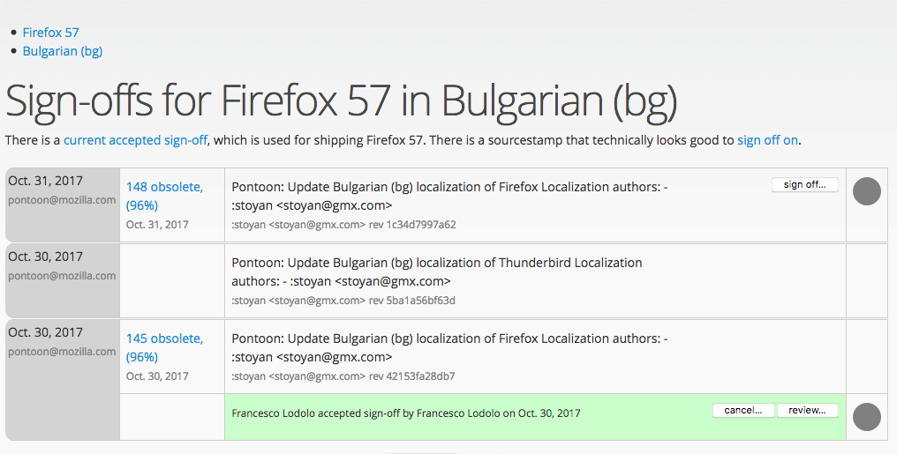
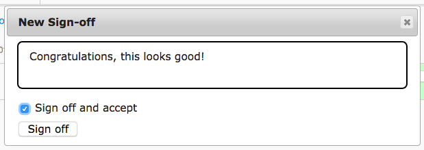
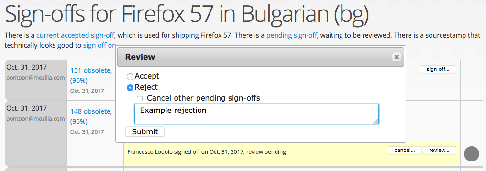

# Sign-offs for Firefox desktop and Firefox for Android

Sign-offs are a way for l10n-drivers to indicate that a specific changeset is technically sound and ready to ship in Firefox desktop or Firefox for Android. Currently, thanks to cross-channel, we ship all versions of Firefox from a [single localization repository](https://hg.mozilla.org/l10n-central/), but sign-offs only happen for the Beta channel:
* Nightly builds always use the tip of the repository, i.e. the latest changes available.
* Beta builds only use the signed off version.
* Release builds uses the latest signed off version from Beta, and can’t normally be updated to use a most recent version.

Sign-offs are tied to a specific app version. For example, Firefox 57 starts in Nightly and doesn’t get any sign-off; it then moves to Beta and get multiple sign-offs as the localization progresses. It then moves to release, and any dot release (e.g. 57.0.1) will use the latest sign-off available for the 57 version, done when it was still in Beta.

Note that sign-offs on Beta are not possible through the entire cycle: sign-offs deadline is normally on Wednesday, about 2 weeks before the release, to allow time for at least one more Beta build before the end of the cycle.

Beta sign-offs are performed on l10n.mozilla.org (elmo) [in this page](https://l10n.mozilla.org/shipping/dashboard?tree=fennec_beta&tree=fx_beta).

## How to perform sign-offs

[This page](https://l10n.mozilla.org/shipping/dashboard?tree=fennec_beta&tree=fx_beta) only includes sign-offs for Firefox desktop (`fx_beta`) and Firefox for Android (`fennec_beta`) beta.

A green checkmark is displayed in the *Status* column if the locale has a sign-off, while it’s empty if there are no sign-offs for this locale. This typically happens for brand new locales that are only shipping in Nightly.

The *Action* column can display several icons:
* A prohibited icon indicates that there is no activity after the last sign-off (belonging to a previous version), and therefore it’s not possible to do an updated sign-off.
* A sparkline icon indicates activity that should be checked:
    * Green indicates that the translation is complete (no error, no missing strings).
    * Orange means that the product is still incomplete.
    * Red means that there are errors in the localization. The number of errors and warnings is also reported within the table.

To perform the sign-off, click on the sparkline icon. It will open a new page, showing information about the last sign-off, and the changesets that follows it.

For each changeset, it’s possible to check `compare-locale`’s results by clicking on the link in the second column from the left. Errors and warnings would be reported in the link too.

Some changesets won’t have a link to `compare-locales`’s results (e.g. the second row in the image above). That indicates a changeset that doesn’t affect the product you’re currently signing off (e.g. a Thunderbird change in Firefox), and it’s not a good candidate for sign-offs.

By clicking in one of the cells in the rightmost column, by default you can display a diff between the latest changeset and the most recent sign-off. Note that both circles can be dragged, to display the diff between specific changesets. It’s also possible to load more changeset at the bottom of the table using the *Load more* button.

In this view, green means that content has been added, red it’s been removed, while orange indicates a change. Each level of the diff can be collapsed simply by clicking on the same line as the file or folder name.

Once you have reviewed the diff, you can return to the previous page, and sign off the changeset by clicking the *sign off…* button. To accept the sign-off, simply click the *Sign off* button:

To explicitly reject a sign-off, unselect the *Sign off and accept* checkbox. Then click on *Review…* and reject the sign-off with a reason.

## Things to check when doing a sign-off

The first thing to do is to look at errors and warnings. For warnings, always double check if the number increased from the last sign-off, identify which changeset introduced new warnings, and if they’re acceptable.

Here are a few more things to look out for when doing sign-offs:
* Strings, or portion of text, remaining in English or becoming empty.
* Translated keyboard shortcuts (command keys). Unlike access keys, they should remain identical to English.
* Changes to files that require review, like `region.properties`.
* [Changes to branding](https://www.mozilla.org/en-US/styleguide/communications/translation/), i.e. translated or transliterated brand names (Mozilla, Firefox).
* Changes to `extensions/spellcheck` (dictionaries). We can only ship dictionaries if they have a compatible license. If a dictionary was already present, it’s likely to be OK. A brand new dictionary should land with a bug associated.
