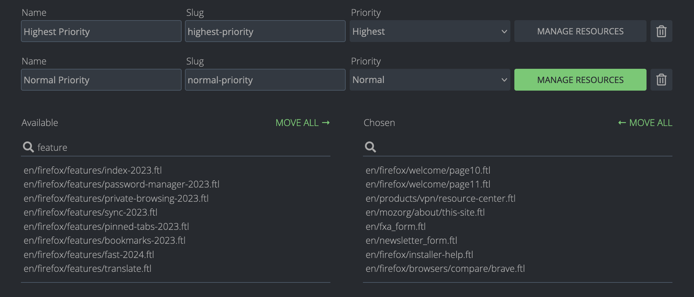

# Adding a new project on Pontoon

## Verify that the project is properly localizable

Project owners can follow the [guidelines](https://mozilla-pontoon.readthedocs.io/en/latest/user/localizing-your-projects.html) available in Pontoon Documentation to properly structure files inside the repository. Some things to check:
* Files should be in a folder like `locale(s)/ab-CD/somefile.extension` and be in one of the supported formats (.ftl, .lang, .properties, .po, .xliff).
* User **mozilla-pontoon** needs write access to the repository.

It’s important to also check the files for localization issues before exposing them to localizers: unclear strings, lack of localization comments, missing plural forms are some of the things to check.

## Create the project in Pontoon STAGE instance

First you want to test that everything works using Pontoon staging server.

Access Pontoon’s [admin console](https://mozilla-pontoon-staging.herokuapp.com/admin/) on the **stage server** and click **ADD NEW PROJECT**.
* Name: name of the repository (it will be displayed in Pontoon’s project selector).
* Slug: used in URLs, will be generated automatically based on the repository’s name.
* Locales:
  * Select at least one locale. To make things faster it’s possible to copy supported locales from an existing project.
  * The *Read-only* column can be used to add languages in read-only mode. In this way, their translations will be available to other languages in the LOCALES tab when translating, but it won’t be possible to change or submit translations directly in Pontoon.
  * You can uncheck the `Locales can opt-in` checkbox to prevent localizers from requesting this specific project.
* Repositories: select the type of repository and URL. Make sure to use SSH to allow write access. For example, if the repository is `https://github.com/meandavejustice/min-vid`, the URL should be `git@github.com:meandavejustice/min-vid.git`. You can use the *Clone or download* button in the repository page on GitHub, making sure that *Clone with SSH* is selected.
* Leave the `Branch` field empty, unless developers asked to commit translations in a branch instead of *master*.
* Download prefix: a URL prefix for downloading localized files. For GitHub repositories, select any localized file on GitHub, click `Raw` and replace locale code and the following bits in the URL with `{locale_code}`. For example, if the link is `https://raw.githubusercontent.com/bwinton/TabCenter-l10n/master/locales/en-US/addon.properties`, the field should be set to `https://github.com/bwinton/TabCenter-l10n/blob/master/locales/{locale_code}`. If you use a project configuration file, you need to provide the path to the raw TOML file on GitHub, e.g. https://raw.githubusercontent.com/mozilla/common-voice/main/l10n.toml.
* Public Repository Website: displayed on dashboards. E.g. `https://github.com/meandavejustice/min-vid`. Pontoon will try to prefill it after you enter Repository URL.
* Project info: provide some information about the project to help localizers with context or testing instructions. HTML is supported, so you can add external links. For example:

```HTML
Localization for the <a href="https://testpilot.firefox.com/experiments/min-vid">Min Vid add-on</a>.
```

* Internal admin notes: use them e.g. for developer contacts and information that other PMs will find useful when covering for you.
* Deadline: if available, enter project deadline in the YYYY-MM-DD format.
* Priority: select priority level from one of the 5 levels available (Lowest, Low, Normal, High, Highest).
* Contact: select the L10n driver in charge of the project, probably yourself.
* External Resources: provide links to external resources like l10n preview environment. You need to enter the name and the URL for each resource. You can also pick one of the predefined names: Development site, Production site, Development build, Production build, Screenshots, Language pack.
* Visibility: determines who can access the project. Pontoon supports the following visibility types:
  * private (default) - only administrators can access the project.
  * public - the project is visible for everyone.

Click **SAVE PROJECT** at the bottom of the page, then click **SYNC** to run a test sync. In the [Sync log](https://mozilla-pontoon-staging.herokuapp.com/sync/log/) you should be able to see if it succeeded or failed.

### Tags

Tags can be used in a project to logically group resources, assigning them a priority. To enable tags for a project, check *Tags enabled* and save the project.

For each tag, it’s possible to define:
* *Name*: it will be displayed in project (e.g. `/projects/firefox/tags/`) and localization dashboards (e.g. `/it/firefox/tags/`), but also in search filters.
* *Slug*: used in URLs for tag dashboards, e.g. `/projects/firefox/tags/devtools/`.
* *Priority*: like for a project, it’s possible to select a priority level from one of the 5 levels available (Lowest, Low, Normal, High, Highest).



Once you’ve created a new tag, you need to save the project in order to be able to manage the resources associated to the tag itself, using the button highlighted in red.

A few tips on using this section:
* Use the selector on the right (highlighted in orange) to switch between *Linked* resources, i.e. resources already associated to the tag, and *Unlinked* resources.
* The first checkbox on the left (highlighted in green) allows to select all displayed items. Note: if the search returns multiple pages, only those currently displayed are selected and will be linked if *Link resources* is clicked.
* There is no need to save the project when adding resources to a tag: linked resources are stored in the database as soon as they’re added with the *Link resources* button.

Considering the amount of information required to properly set up tags in a project, it’s recommended to set them up directly in production, and use stage only for specific testing.

### Resource deadline

Like for a project, it’s possible to set a deadline for a Resource.

Go to the [resource section](https://pontoon.mozilla.org/a/base/resource/) of the admin panel, then type the name of your project (e.g. `engagement`) and hit `Enter`. All the resources for your project should appear. Click on the one you want to edit, set the deadline in the `Deadline` field, then click `SAVE`.

## Create the project in Pontoon PROD instance

At this point you need to repeat the same steps on the **production server**.

Access Pontoon’s [admin console](https://pontoon.mozilla.org/admin/), add the same information you used on the staging server and make sure to select all supported locales for this project.

The new project will appear in the [public list of Projects](https://pontoon.mozilla.org/projects/) only after the next sync cycle.
